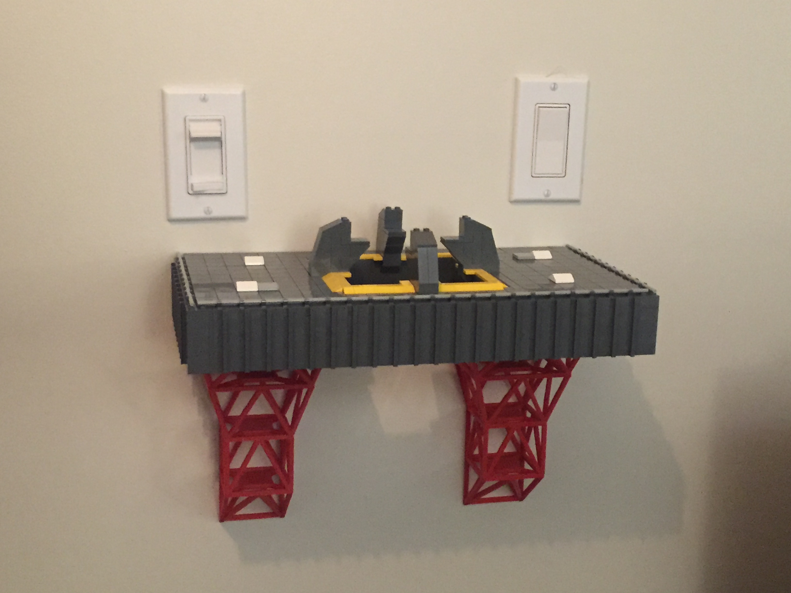
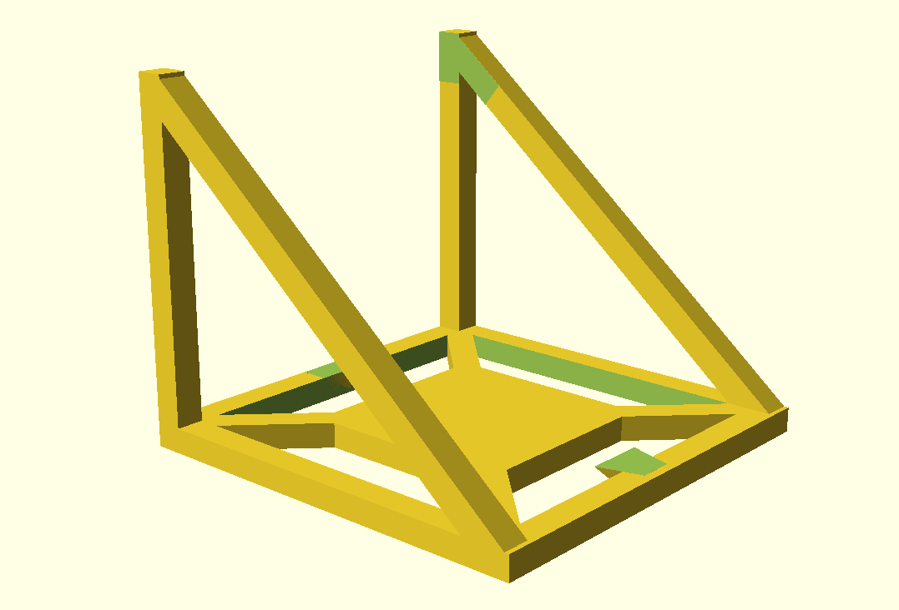
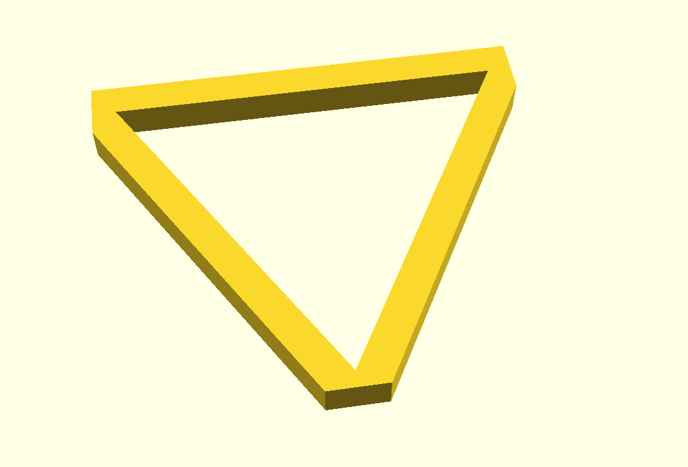
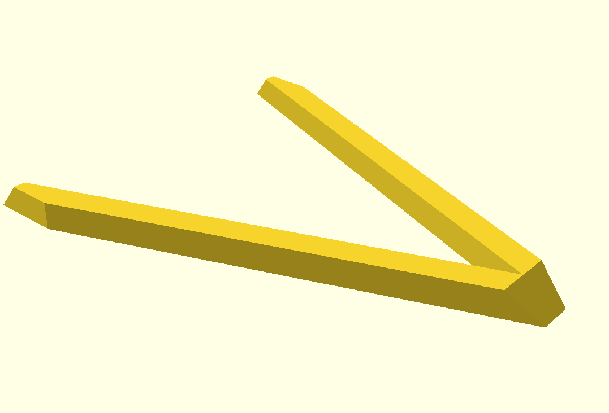
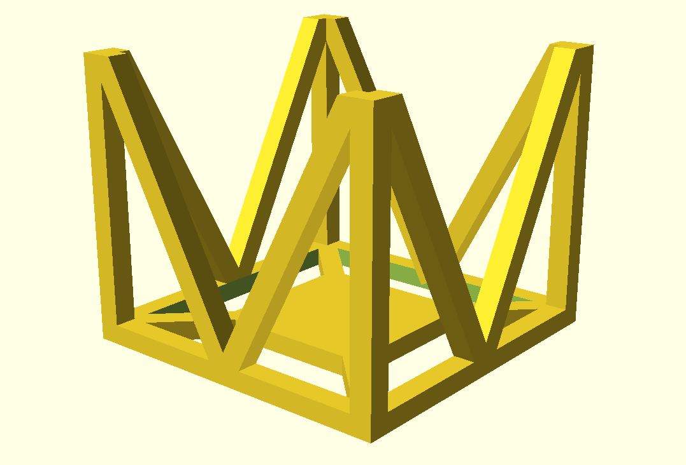
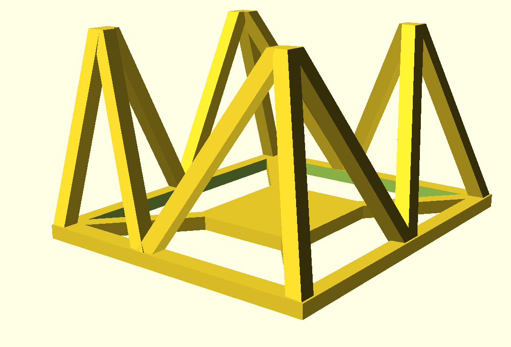
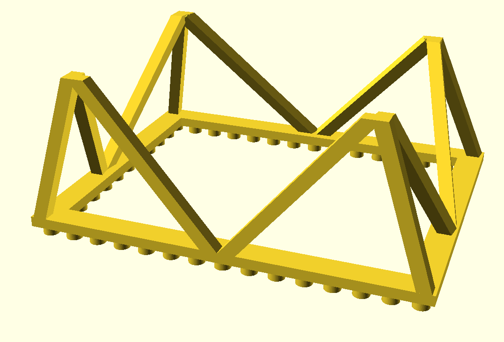
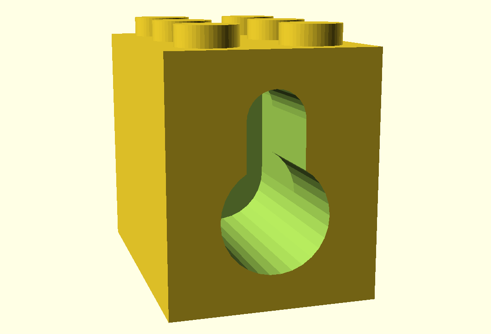

# Lego Saturn V Shelf

This is a shelf for the [Lego Saturn V (21309)](https://shop.lego.com/en-CA/LEGO-NASA-Apollo-Saturn-V-21309),
made mostly out of Lego, with some 3D printed parts. Inspired by the [Saturn V Mobile Launcher Platform](http://www.savethelut.org/MLDocs/ap4-KSC-67PC-368.jpg), and it's gantry.
 

 
The only 3D printed parts are the screw mounts on the back, and the supports
underneath that are styled like the Saturn V gantry. Everything else is Lego.

## Lego Model

The model ([SaturnVShelf.lxf](SaturnVShelf.lxf)) can be opened with
[Lego Digital Designer](http://ldd.lego.com/en-us/)
4.3.

The included BOM ([SaturnVShelf-BOM.xlsx](SaturnVShelf-BOM.xlsx)) exported by LDD lists the pieces
needed. You can use this to place an order most of the parts from [Pick-A-Brick](https://shop.lego.com/Pick-a-Brick).
The remainder can be had from [BrickLink](bricklink.com).

When I ordered pieces for this (June 2017) everything was available on Pick-A-Brick except for the
flat yellow tiles around the hole in the top. These were available on BrickLink.

## 3D Printing

Printing the gantry was, admittedly, a challenge. By separating each gantry
into 4 pieces, and further separating one of these pieces into 3 more, I was
able to print it successfully.

All files for 3D printing are within the [3D Printing](3DPrinting) folder. All the models
are done with [OpenSCAD](www.openscad.org).

- [shelf.scad](3DPrinting/shelf.scad) - Main rendering, and modules for all the gantry parts. 
- [rocket-bottom.scad](3DPrinting/rocket-bottom.scad) - Rough rendering of the bottom of the Lego Saturn V model. Only used for visualizing how the shelf will look.
- [screwmount.scad](3DPrinting/screwmount.scad) - Model for the part that holds the screws at the back of the shelf.

### Models

The [3DPrinting/prints](3DPrinting/prints) folder has the models for the gantry broken into individual parts for printing.
Both the OpenSCAD source file (`.scad`) and exported model (`.stl`) are included, so you shouldn't need OpenSCAD unless you
want to modify the models.
 
Gantry Layer 1 is split into 3 prints because I was unable to get it to print successfully as one piece. Your millage may vary.

[gantry_layer_1.stl](3DPrinting/prints/gantry_layer_1.stl)/[scad](3DPrinting/prints/gantry_layer_1.scad) - Lowest part of gantry, with center parts cut of for easier printing. 

[gantry_layer_1a.stl](3DPrinting/prints/gantry_layer_1a.stl)/[scad](3DPrinting/prints/gantry_layer_1a.scad) - One of the center parts.

[gantry_layer_1b.stl](3DPrinting/prints/gantry_layer_1b.stl)/[scad](3DPrinting/prints/gantry_layer_1b.scad) - The other center part.

[gantry_layer_2.stl](3DPrinting/prints/gantry_layer_2.stl)/[scad](3DPrinting/prints/gantry_layer_2.scad) - 2nd from bottom part of shelf. Straight sides, no angle. 

[gantry_layer_3.stl](3DPrinting/prints/gantry_layer_3.stl)/[scad](3DPrinting/prints/gantry_layer_3.scad) - 2nd from top part of shelf, angled sides.

[gantry_layer_4.stl](3DPrinting/prints/gantry_layer_4.stl)/[scad](3DPrinting/prints/gantry_layer_4.scad) - Top part of the gantry, with studs for mounting to the bottom of the shelf, and angled sides.

[screwmount.stl](3DPrinting/prints/screwmount.stl)/[scad](3DPrinting/prints/screwmount.scad) - Screw mounts for the back of the shelf. You'll need 3 of these.

### Printing

I printed this with ABS. This allows for using acetone to glue the different parts together quite strongly.

You'll need to figure out the best settings for your printer, but this is what I used:
- 0.4mm nozzle
- 0.1mm layers
- 100% infill
- 2.0mm wall thickness
- 1.2mm top/bottom thickness
- Inner before outer walls
- Support
  - Everywhere
  - 10 degree overhang angle
  - 15% density
  - 0.1mm Z distance (top and bottom)
  - 0.7mm X/Y distance 
- Raft
  - 5mm extra margin
  - 0.1mm air gap
  - 0.05mm initial z layer overlap
  - 2 top layers